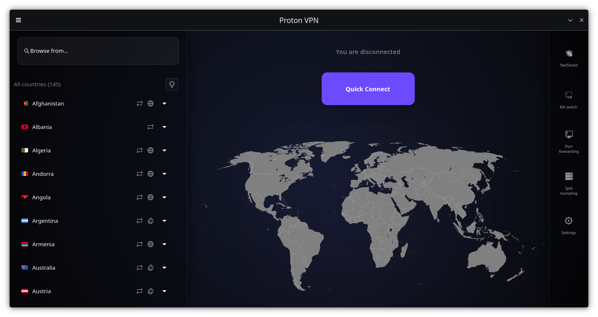

# Proton VPN GTK: The "Fine, I'll Do It Myself" Edition 🐧

> *The modern interface Proton VPN couldn't (or just wouldn't) build for us.*

## 📖 The Story (Why Does This Exist?)

Because if we waited for the Proton VPN team to release a modern, updated GUI for Linux users, the sun would probably burn out first.

I couldn't stand the fact that the official app hasn't evolved a single bit in years, practically treating Linux users like cavemen who only live in the terminal and despise aesthetics. Saying "If they won't do it, I will," I rolled up my sleeves and gave this GTK interface a proper facelift.

In short, this project is for all Linux users who care about privacy but also want an app that remembers we are living in the current decade. 

## 🛠️ Contributing

If you also believe Linux users aren't second-class citizens, our doors are open for Pull Requests. Report bugs, suggest improvements, or tweak the code. Hey, at least *we* actually push updates for our app!
